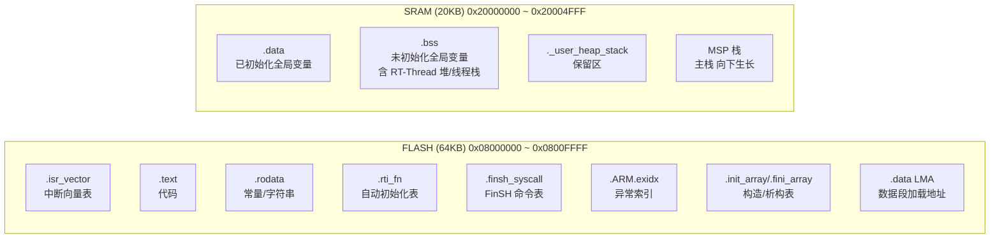
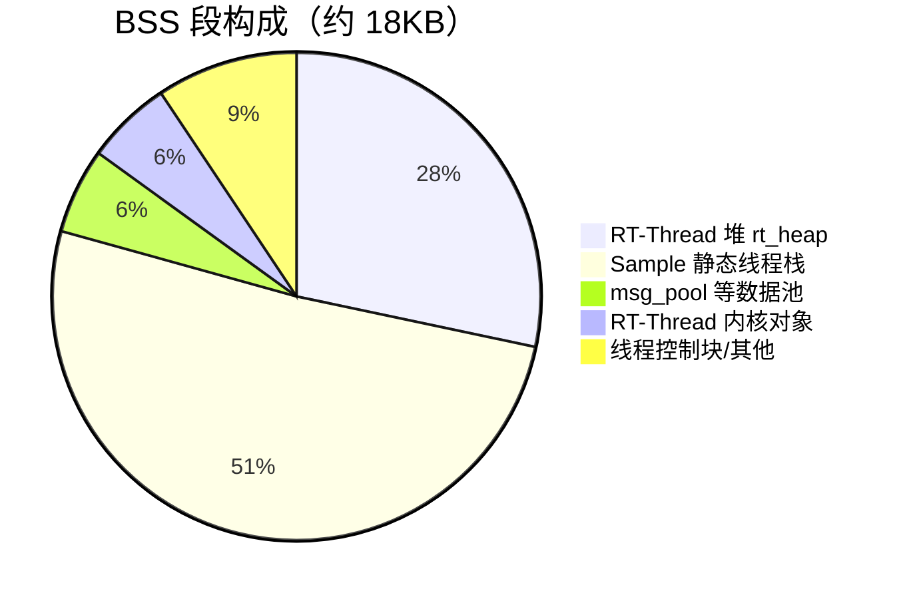
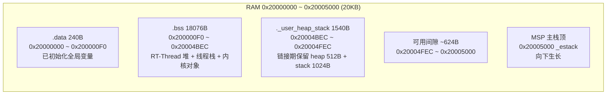
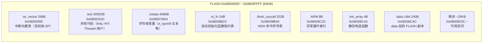

# STM32-Nano 固件内存布局分析

> 目标芯片：STM32F103C8T6
> 工具链：arm-none-eabi-gcc 15.2
> 链接脚本：`STM32F103XX_FLASH.ld`
> 分析日期：2026-07-24

---

## 一、物理内存映射

STM32F103C8T6 拥有 **64KB FLASH** 和 **20KB SRAM**：



### 1.1 链接脚本内存定义

```ld
MEMORY
{
  RAM (xrw)   : ORIGIN = 0x20000000, LENGTH = 20K
  FLASH (rx)  : ORIGIN = 0x08000000, LENGTH = 64K
}

_estack = ORIGIN(RAM) + LENGTH(RAM);   /* 0x20005000，栈顶在 RAM 末端 */
_Min_Heap_Size = 0x200;                /* 512 字节，链接期检查用 */
_Min_Stack_Size = 0x400;               /* 1024 字节，MSP 主栈保留 */
```

---

## 二、实际内存占用（来自构建输出）

### 2.1 汇总（`arm-none-eabi-size`）

```
   text    data     bss     dec     hex filename
  36188     240   19616   56044    daec build/Debug/stm32-nano.elf
```

| 项目 | 大小 | 说明 |
|------|------|------|
| `text` | 36188 B | 代码 + 只读数据（占用 FLASH） |
| `data` | 240 B | 已初始化变量（FLASH 存初值，RAM 存运行值） |
| `bss` | 19616 B | 未初始化变量（仅占 RAM） |

### 2.2 FLASH 占用：36428 / 65536 B（55.6%）

| Section | 大小 (B) | 起始地址 | 说明 |
|---------|----------|----------|------|
| `.isr_vector` | 268 | `0x08000000` | 中断向量表 |
| `.text` | 30932 | `0x0800010C` | 代码段 |
| `.rodata` | 4696 | `0x080078D4` | 常量、字符串 |
| `.rti_fn` | 24 | `0x08008B2C` | RT-Thread 自动初始化函数表 |
| `.finsh_syscall` | 252 | `0x08008B44` | FinSH 命令符号表 |
| `.ARM` | 8 | `0x08008C3C` | 异常展开索引 |
| `.init_array` | 4 | `0x08008C44` | 静态构造函数表 |
| `.fini_array` | 4 | `0x08008C48` | 静态析构函数表 |
| `.data` (LMA) | 240 | `0x08008C4C` | .data 段在 FLASH 的加载副本 |
| **合计** | **36428** | | **占 64KB 的 55.6%** |

### 2.3 RAM 占用：19856 / 20480 B（96.9%）

| Section | 大小 (B) | 起始地址 | 说明 |
|---------|----------|----------|------|
| `.data` | 240 | `0x20000000` | 已初始化全局变量（运行时） |
| `.bss` | 18076 | `0x200000F0` | 未初始化全局变量 |
| `._user_heap_stack` | 1540 | `0x20004BEC` | 链接期保留的 heap+stack |
| **合计** | **19856** | | **占 20KB 的 96.9%** |

> ⚠️ RAM 仅剩余 624 字节，MSP 主栈从 `0x20005000` 向下生长，与 `._user_heap_stack` 顶端 `0x20004FEC` 之间为可用空间。

---

## 三、RAM 布局详解（BSS 大户）

通过 `arm-none-eabi-nm -S --size-sort` 分析 BSS 段最大符号：

| 符号 | 大小 (B) | 地址 | 来源 | 说明 |
|------|----------|------|------|------|
| `rt_heap` | 5120 | `0x20000110` | `board.c` | RT-Thread 动态堆（`RT_HEAP_SIZE=5*1024`） |
| `thread2_stack` ×5 | 5120 | 散布 | 各 sample | 5 个 sample 各 1024B 静态栈 |
| `thread1_stack` ×4 | 4096 | 散布 | 各 sample | 4 个 sample 各 1024B 静态栈 |
| `msg_pool` | 1024 | `0x20003184` | `msgq_sample.c` | 消息队列内存池 |
| `rt_thread_stack` | 256 | `0x200015E0` | RT-Thread 内核 | 调度器/timer 线程栈 |
| `rt_thread_priority_table` | 256 | `0x200017C0` | RT-Thread 内核 | 优先级就绪表 |
| `finsh_prompt` | 129 | `0x20001918` | FinSH | shell 提示符缓冲 |
| `thread1/2` 控制块 ×N | ~128 每个 | 散布 | 各 sample | `struct rt_thread` |

**BSS 占用构成（约 18076 B）：**



---

## 四、运行时内存视图



### 4.1 栈的生长方向

- **MSP（主栈）**：从 `_estack`（`0x20005000`）**向下**生长，用于 ISR 和启动阶段
- **PSP（线程栈）**：RT-Thread 调度器启动后，各线程使用各自独立的静态栈（位于 `.bss`），从栈顶向下生长

### 4.2 堆的归属

本项目存在**两个堆**：

| 堆 | 大小 | 用途 | 管理者 |
|----|------|------|--------|
| `rt_heap` | 5120 B | RT-Thread 动态内存（`rt_malloc`/`rt_thread_create`） | RT-Thread small mem 算法 |
| `._user_heap_stack` 中的 heap | 512 B | newlib `malloc`（`_sbrk`） | newlib，从 `_end` 向上生长 |

> 实际项目中 newlib 的 `malloc` 很少使用，主要由 RT-Thread 堆承担动态分配。

---

## 五、FLASH 布局详解



### 5.1 启动时的数据搬运

复位时 `Reset_Handler` 执行：

1. 从 `.data` 的 LMA（`0x08008C4C`）复制 240 字节到 VMA（`0x20000000`）
2. 清零 `.bss`（`0x200000F0` ~ `0x20004BEC`，共 18076 字节）

---

## 六、内存使用率与优化建议

### 6.1 当前使用率

| 区域 | 已用 | 总量 | 使用率 | 剩余 |
|------|------|------|--------|------|
| **FLASH** | 36428 B | 65536 B | 55.6% | 29108 B |
| **RAM** | 19856 B | 20480 B | **96.9%** | **624 B** |

### 6.2 RAM 优化方向

RAM 已接近满载，若需新增功能可考虑：

1. **减小 RT-Thread 堆**：`RT_HEAP_SIZE` 从 5KB 降至 3KB（省 2KB）
2. **减小 sample 静态栈**：各 `thread*_stack[1024]` 降至 `[512]`（每个省 512B，共可省 ~7KB）
3. **裁剪未用组件**：如不使用 FinSH 可关闭 `RT_USING_FINSH`（省 ~1KB BSS + 栈）
4. **关闭动态创建**：禁用 `RT_USING_HEAP`，全部用静态线程（省 `rt_heap` 5KB，但失去 `rt_thread_create` 能力）

### 6.3 FLASH 优化方向

FLASH 余量充足（~29KB），若后续紧张可：

1. **提高优化等级**：`-O0` → `-Os`（当前 Debug 用 `-O0`，Release 可显著缩小）
2. **关闭 FinSH 描述**：`FINSH_USING_DESCRIPTION` 可省命令帮助字符串
3. **启用 LTO**：链接期优化跨文件内联

---

## 七、关键地址速查表

| 符号 | 地址 | 说明 |
|------|------|------|
| `ORIGIN(FLASH)` | `0x08000000` | FLASH 起始 |
| `ORIGIN(RAM)` | `0x20000000` | RAM 起始 |
| `_estack` | `0x20005000` | 栈顶（RAM 末端） |
| `_sdata` / `_edata` | `0x20000000` / `0x200000F0` | .data 段 VMA |
| `_sidata` | `0x08008C4C` | .data 段 LMA（FLASH 副本） |
| `_sbss` / `_ebss` | `0x200000F0` / `0x20004BEC` | .bss 段范围 |
| `_end` / `end` | `0x20004790` | BSS 末尾（newlib 堆起点） |
| `rt_heap` | `0x20000110` | RT-Thread 堆起始 |
