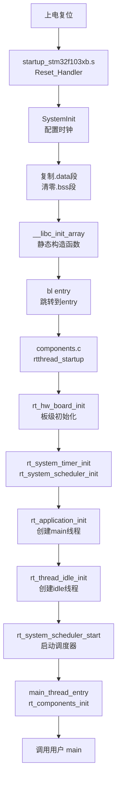
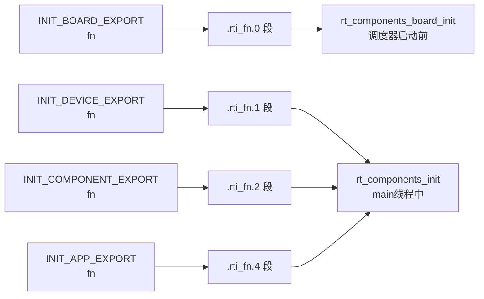
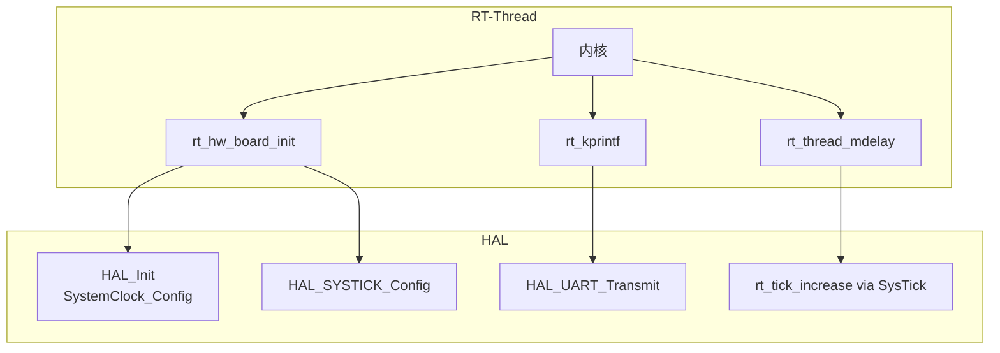

# STM32 + RT-Thread 启动流程与集成方式分析

> 项目：stm32-nano（STM32F103C8 + RT-Thread）
> 工具链：arm-none-eabi-gcc 15.2 + CMake + Ninja
> 分析日期：2026-07-24

---

## 一、整体启动流程



### 1.1 硬件复位阶段（汇编启动）

入口由链接脚本指定：`-Wl,-eentry`，但实际复位首先执行的是 `startup_stm32f103xb.s` 中的 `Reset_Handler`：

1. **设置栈指针**：向量表第一个字 `_estack`（RAM 末尾 `0x20005000`）自动装入 SP
2. **调用 `SystemInit`**：在 `system_stm32f1xx.c` 中，配置中断向量表偏移（不配置时钟，时钟在 `main` 里配）
3. **复制 .data 段**：从 FLASH（`_sidata`）复制到 RAM（`_sdata`~`_edata`）
4. **清零 .bss 段**：`_sbss`~`_ebss`
5. **调用 `__libc_init_array`**：执行 C 静态构造函数
6. **`bl entry`**：跳转到 RT-Thread 的 `entry()` 函数（不是用户的 `main`！）

### 1.2 RT-Thread 接管阶段

`entry()` 定义在 `components.c`，是 GCC 工具链下 RT-Thread 的真正入口：

```c
int entry(void)
{
    rtthread_startup();
    return 0;
}
```

`rtthread_startup()` 完成内核初始化：

| 步骤 | 函数 | 作用 |
|------|------|------|
| 1 | `rt_hw_interrupt_disable()` | 关中断 |
| 2 | `rt_hw_board_init()` | **板级初始化**（关键） |
| 3 | `rt_show_version()` | 打印版本 |
| 4 | `rt_system_timer_init()` | 系统定时器初始化 |
| 5 | `rt_system_scheduler_init()` | 调度器初始化 |
| 6 | `rt_application_init()` | **创建 main 线程** |
| 7 | `rt_system_timer_thread_init()` | 软定时器线程 |
| 8 | `rt_thread_idle_init()` | idle 线程 |
| 9 | `rt_system_scheduler_start()` | **启动调度器**（不再返回） |

### 1.3 板级初始化（`rt_hw_board_init`）

定义在 `board.c`，是 RT-Thread 与 STM32 HAL 的桥梁：

```c
void rt_hw_board_init(void)
{
    HAL_Init();                    // HAL 库初始化
    SystemClock_Config();          // 配置系统时钟（72MHz）
    SystemCoreClockUpdate();
    HAL_SYSTICK_Config(...);       // 配置 SysTick 为 OS Tick

    rt_components_board_init();    // 板级组件自动初始化

    rt_system_heap_init(rt_heap_begin_get(), rt_heap_end_get());  // 初始化 RT-Thread 堆
}
```

**OS Tick 来源**：`SysTick_Handler`（同在 `board.c`）调用 `rt_tick_increase()`，驱动 RT-Thread 的时钟节拍。

### 1.4 main 线程与用户 main

`rt_application_init()` 创建名为 `"main"` 的线程，入口函数是 `main_thread_entry`：

```c
void main_thread_entry(void *parameter)
{
    rt_components_init();   // 组件自动初始化（finsh 等）
    main();                 // 最终调用用户的 main()
}
```

**关键点**：用户的 `main()` 是在一个 RT-Thread 线程中运行的，`main()` 返回后该线程结束，但系统不会停止（idle 线程持续运行）。

### 1.5 自动初始化机制（核心集成技巧）

RT-Thread 通过段链接（section）实现自动初始化，无需手动调用：



例如 `board.c` 中的 UART 初始化：

```c
INIT_BOARD_EXPORT(uart_init);   // 自动在板级初始化阶段执行
```

链接脚本 `STM32F103XX_FLASH.ld` 中的 `.rti_fn` 段收集这些函数指针，按优先级排序后依次调用。

---

## 二、RT-Thread 集成方式

### 2.1 源码集成（CMake 组织）

项目通过 CMake 将 RT-Thread 作为 OBJECT 库集成，见 `cmake/stm32cubemx/CMakeLists.txt`：

```
RT-Thread 库组成：
├── bsp/_template/cubemx_config/board.c   ← 板级适配层
├── src/*.c                                ← 内核核心（scheduler/thread/ipc/...）
├── libcpu/arm/cortex-m3/context_gcc.S     ← 上下文切换（PendSV）
├── libcpu/arm/cortex-m3/cpuport.c         ← CPU 移植层
└── components/finsh/src/*.c               ← FinSH shell 组件
```

### 2.2 三个适配层

| 层级 | 文件 | 职责 |
|------|------|------|
| **板级适配** | `board.c` | `rt_hw_board_init`、OS Tick、堆、控制台输出 |
| **CPU 移植** | `libcpu/arm/cortex-m3/` | `PendSV_Handler`（上下文切换）、`SVC_Handler` |
| **配置** | `RT-Thread/rtconfig.h` | 功能裁剪（启用/禁用 IPC、FinSH 等） |

### 2.3 关键钩子点

- **`entry()`**：劫持启动入口，替代直接调用 `main()`
- **`rt_hw_board_init()`**：RT-Thread 调用 HAL 的唯一入口
- **`SysTick_Handler`**：HAL 的中断被 RT-Thread 接管作为 OS Tick
- **`PendSV_Handler`**：被 `context_gcc.S` 重写，实现线程切换
- **`rt_hw_console_output()`**：RT-Thread 的 `rt_kprintf` 通过它输出到 UART

### 2.4 与 STM32 HAL 的关系



RT-Thread **不替代 HAL**，而是复用 HAL 的外设驱动。HAL 的 `HAL_Init`、`SystemClock_Config`、`HAL_UART_Transmit` 等都被 RT-Thread 在 `board.c` 中调用。

### 2.5 用户代码集成方式

用户的 `main()` 在 main 线程中运行，可通过两种方式使用 RT-Thread：

- **直接调用 API**：如 `main.c` 中的 `rt_kprintf`、`rt_thread_mdelay`
- **MSH 命令导出**：如各 sample 文件的 `MSH_CMD_EXPORT(msgq_sample, ...)`，在 FinSH shell 中输入命令名即可运行

---

## 三、总结

**启动路径**：

```
Reset_Handler
  → entry()
  → rtthread_startup()
  → rt_hw_board_init()        (HAL 初始化)
  → rt_application_init()     (创建 main 线程)
  → rt_system_scheduler_start()  (调度器启动)
  → main_thread_entry
  → rt_components_init()
  → 用户 main()
```

**集成核心**：

- RT-Thread 通过 `entry()` 劫持启动流程
- 通过 `board.c` 适配硬件（复用 HAL）
- 通过 `rtconfig.h` 裁剪功能
- 通过 `INIT_*_EXPORT` 宏实现组件自动初始化

用户的 `main()` 退化为一个普通线程，系统生命周期由 RT-Thread 调度器管理。
